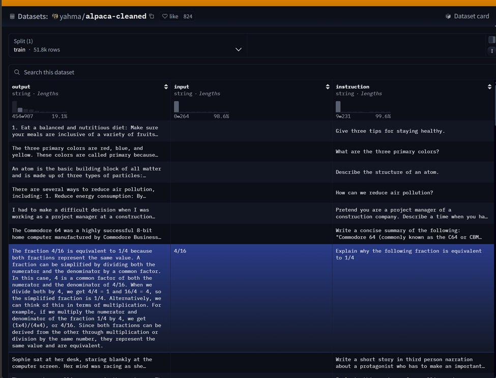

<div align="center">

# 🦙 Fine-Tuning TinyLlama with QLoRA

### A beginner-friendly, step-by-step guide to instruction fine-tuning an LLM on a single GPU

[](https://www.python.org/)
[](https://github.com/huggingface/transformers)
[](https://github.com/huggingface/peft)
[](https://opensource.org/licenses/MIT)

*Train a 1.1B parameter chat model to follow instructions — using 4-bit quantization so it fits on a free Colab GPU.*

</div>

---

## 📖 What is this?

This repository walks you through **fine-tuning [TinyLlama-1.1B-Chat](https://huggingface.co/TinyLlama/TinyLlama-1.1B-Chat-v1.0)** on an instruction dataset using **QLoRA** — a technique that lets you train large language models on modest hardware.

Every step is heavily commented and explained, so this works equally well as a **learning resource** and as a **ready-to-run script**.

> 💡 **New to fine-tuning?** Don't worry. Read the [Core Concepts](#-core-concepts-explained) section first, then follow the steps in order.

---

## 🧠 Core Concepts Explained

Before diving into code, let's understand the three ideas that make this possible.

### What is fine-tuning?

A base model like TinyLlama already "knows language." **Fine-tuning** nudges it toward a *specific behavior* — in our case, **following instructions** and giving helpful responses.

### What is LoRA?

Instead of updating *all* of the model's parameters (expensive, memory-hungry), **LoRA (Low-Rank Adaptation)** freezes the original model and trains tiny "adapter" matrices on top.

```
Full fine-tuning  →  update 1,100,000,000 parameters  😩
LoRA fine-tuning  →  update ~0.1% of them              😎
```

### What is QLoRA?

**QLoRA = Quantization + LoRA.** The base model is loaded in **4-bit precision** (instead of 16 or 32-bit), drastically cutting memory use, while the small LoRA adapters are trained on top.

| Approach | GPU Memory (≈) | Trains |
|----------|:--------------:|:-------|
| Full fine-tuning | 🔴 Very high | All weights |
| LoRA | 🟡 Medium | Adapters only |
| **QLoRA** | 🟢 **Low** | Adapters only (4-bit base) |

This is why this whole project runs on a **single consumer / free-tier GPU**.

---

## 🗂️ The Pipeline at a Glance

```
┌─────────────┐   ┌──────────────┐   ┌─────────────┐   ┌──────────────┐
│  1. Install │ → │  2. Load 4-  │ → │  3. Format  │ → │  4. Attach   │
│   libraries │   │   bit model  │   │   dataset   │   │  LoRA layers │
└─────────────┘   └──────────────┘   └─────────────┘   └──────────────┘
                                                              │
                  ┌──────────────┐   ┌─────────────┐         ▼
                  │  7. Test the │ ← │  6. Save the│ ← ┌──────────────┐
                  │     model    │   │   adapter   │   │  5. Train!   │
                  └──────────────┘   └─────────────┘   └──────────────┘
```

---

## ⚙️ Requirements

- A GPU with **bfloat16 support** (Google Colab T4 / any modern NVIDIA GPU works)
- Python 3.10+

---

## 🚀 Step-by-Step Guide

### Step 1 — Install the libraries

We rely on the Hugging Face ecosystem plus a couple of helpers.

```bash
pip install -U transformers datasets accelerate peft trl bitsandbytes
```

| Library | Role |
|---------|------|
| `transformers` | Loads models like TinyLlama |
| `datasets` | Loads the training data |
| `accelerate` | Handles GPU/CPU device placement |
| `peft` | Provides LoRA / QLoRA |
| `trl` | Provides `SFTTrainer` for supervised fine-tuning |
| `bitsandbytes` | Enables 4-bit quantization |

---

### Step 2 — Import everything

```python
import torch
from datasets import load_dataset

from transformers import (
    AutoModelForCausalLM,   # Loads causal language models for text generation
    AutoTokenizer,          # Converts text ↔ tokens
    BitsAndBytesConfig,     # Configuration for 4-bit quantization
    TrainingArguments,      # Stores training hyperparameters
)

from peft import LoraConfig   # LoRA configuration
from trl import SFTTrainer    # Trainer for supervised fine-tuning
```

---

### Step 3 — Choose your model and dataset

```python
# TinyLlama: a small chat model — perfect for learning QLoRA.
model_name = "TinyLlama/TinyLlama-1.1B-Chat-v1.0"

# A cleaned version of the popular Alpaca instruction dataset.
dataset_name = "yahma/alpaca-cleaned"
```

> 📦 **About the dataset:** Each row contains an `instruction`, an optional `input`, and the target `output`.
>
> ```json
> {
>   "instruction": "Explain gravity simply.",
>   "input": "",
>   "output": "Gravity is the force that pulls objects toward each other."
> }
> ```
>
> This teaches the model the pattern: **instruction → response**.

Here's what the real dataset looks like in the Hugging Face dataset viewer — **51.8k rows** of `output`, `input`, and `instruction` columns:

<div align="center">
  
</div>

> 👀 Notice that the `input` column is **empty for most rows** (~98% of the time) — that's exactly why our formatting function in [Step 8](#step-8--format-each-example-into-a-prompt) handles both cases (with and without input).

---

### Step 4 — Configure 4-bit quantization (the "Q" in QLoRA)

```python
bnb_config = BitsAndBytesConfig(
    load_in_4bit=True,                      # Load base model in 4-bit → big memory savings
    bnb_4bit_quant_type="nf4",              # NF4 = NormalFloat4, tuned for LLM weight distributions
    bnb_4bit_compute_dtype=torch.bfloat16,  # Store in 4-bit, but compute in bfloat16
    bnb_4bit_use_double_quant=True,         # Quantize the quantization scales too → even less memory
)
```

> 🔍 **Why NF4?** LLM weights cluster around zero. NF4 is designed for this normal distribution and usually preserves quality better than plain INT4.

---

### Step 5 — Load the tokenizer

```python
tokenizer = AutoTokenizer.from_pretrained(model_name)

# TinyLlama has no dedicated pad token, so we reuse the end-of-sequence token.
tokenizer.pad_token = tokenizer.eos_token

# Right padding is standard for causal LMs.
tokenizer.padding_side = "right"
```

---

### Step 6 — Load the model in 4-bit

```python
model = AutoModelForCausalLM.from_pretrained(
    model_name,
    quantization_config=bnb_config,  # Apply the QLoRA 4-bit settings
    device_map="auto",               # Auto-place layers on GPU/CPU
)

# use_cache speeds up inference but conflicts with training — disable it for now.
model.config.use_cache = False
```

---

### Step 7 — Load and trim the dataset

```python
dataset = load_dataset(dataset_name, split="train")

# Use only 2,000 examples for a fast demo run.
# Remove this line to train on the full dataset.
dataset = dataset.select(range(2000))
```

---

### Step 8 — Format each example into a prompt

LLMs don't read Python dictionaries — they read text. We convert every row into a consistent prompt template.

```python
def format_example(example):
    instruction = example["instruction"]
    input_text  = example["input"]
    output      = example["output"]

    if input_text and len(input_text.strip()) > 0:
        text = f"""### Instruction:
{instruction}

### Input:
{input_text}

### Response:
{output}"""
    else:
        text = f"""### Instruction:
{instruction}

### Response:
{output}"""

    return text
```

This produces a clean, repeatable structure the model can learn from:

```
### Instruction:
<the task>

### Input:
<optional context>

### Response:
<the answer the model should learn>
```

---

### Step 9 — Configure LoRA (the "LoRA" in QLoRA)

```python
peft_config = LoraConfig(
    r=16,                          # LoRA rank — higher = more capacity (and more memory)
    lora_alpha=32,                 # Scaling strength of the LoRA updates
    lora_dropout=0.05,             # Helps prevent overfitting
    bias="none",                   # Don't fine-tune bias terms
    task_type="CAUSAL_LM",         # Next-token prediction
    target_modules="all-linear",   # Apply LoRA to all linear layers (common in QLoRA)
)
```

---

### Step 10 — Set training hyperparameters

```python
training_args = TrainingArguments(
    output_dir="./tinyllama-qlora-alpaca",
    num_train_epochs=1,                  # 1 epoch is enough for a demo
    per_device_train_batch_size=2,
    gradient_accumulation_steps=4,       # Effective batch size = 2 × 4 = 8
    learning_rate=2e-4,                  # LoRA tolerates higher LRs than full fine-tuning
    logging_steps=20,
    save_steps=200,
    save_total_limit=2,                  # Keep only the 2 latest checkpoints
    bf16=True,                           # bfloat16 training
    optim="paged_adamw_8bit",            # Memory-efficient optimizer for QLoRA
    report_to="none",                    # Disable W&B etc.
)
```

> 🧮 **Effective batch size** = `per_device_train_batch_size × gradient_accumulation_steps`. Gradient accumulation lets you simulate a large batch without the memory cost.

---

### Step 11 — Build the trainer

```python
trainer = SFTTrainer(
    model=model,                       # The 4-bit quantized base model
    train_dataset=dataset,
    peft_config=peft_config,           # The LoRA adapter config
    formatting_func=format_example,    # Turns each row into a prompt
    args=training_args,
    max_seq_length=512,                # Longer examples get truncated
    tokenizer=tokenizer,
)
```

---

### Step 12 — Train! 🏋️

```python
trainer.train()
```

> ❄️ **Remember:** the base TinyLlama weights stay **frozen**. Only the tiny LoRA adapter weights are updated.

---

### Step 13 — Save the adapter

```python
# This saves ONLY the LoRA adapter — not the full model.
trainer.model.save_pretrained("./tinyllama-qlora-adapter")
tokenizer.save_pretrained("./tinyllama-qlora-adapter")
```

> 📌 **To use it later:** load the original base model again, then attach this adapter on top.

---

### Step 14 — Test your fine-tuned model 🎉

```python
prompt = """### Instruction:
Explain what machine learning is in simple words.

### Response:
"""

# return_tensors="pt" → return PyTorch tensors, shaped (batch_size, seq_len).
# .to(model.device) keeps everything on the same device.
inputs = tokenizer(prompt, return_tensors="pt").to(model.device)

# No gradients needed during inference → saves memory & time.
with torch.no_grad():
    outputs = model.generate(
        **inputs,
        max_new_tokens=150,
        temperature=0.7,    # Higher = more creative, lower = more deterministic
        do_sample=True,     # Enable sampling
        top_p=0.9,          # Nucleus sampling
    )

print(tokenizer.decode(outputs[0], skip_special_tokens=True))
```

---

## 🎓 What You Just Learned

By finishing this guide you now understand:

- ✅ How **4-bit quantization** shrinks a model's memory footprint
- ✅ How **LoRA adapters** train a model without touching its original weights
- ✅ How to format an **instruction dataset** for supervised fine-tuning
- ✅ How to run training with `SFTTrainer` and generate text afterward

---

## 🔧 Want to Go Further?

| Idea | How |
|------|-----|
| Train on more data | Remove `dataset.select(range(2000))` |
| Train longer | Increase `num_train_epochs` |
| Try a bigger model | Swap `model_name` for a 7B model |
| More learning capacity | Raise the LoRA `r` value |
| Track metrics | Set `report_to="wandb"` |

---

## 📚 Resources

- [TinyLlama on Hugging Face](https://huggingface.co/TinyLlama/TinyLlama-1.1B-Chat-v1.0)
- [alpaca-cleaned dataset](https://huggingface.co/datasets/yahma/alpaca-cleaned)
- [QLoRA paper](https://arxiv.org/abs/2305.14314)
- [PEFT documentation](https://huggingface.co/docs/peft)
- [TRL documentation](https://huggingface.co/docs/trl)

---

<div align="center">

**⭐ If this helped you, consider starring the repo!**

Made with ❤️ for everyone learning to fine-tune LLMs

</div>
